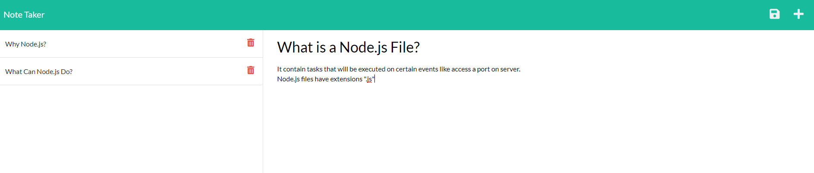
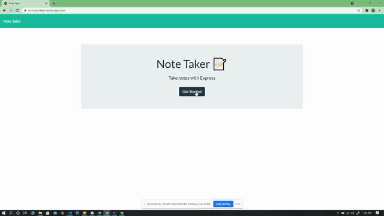

# Note Taker

1. [Description](#desc)
2. [Web Address](#webaddress)
3. [Usage Tips](#usage)
4. [Features](#feature)
5. [Install Command](#command)
6. [Credits](#credits)
7. [Licenses](#licenses)
8. [Questions and Contributing](#qnacontri)

---

---

## Description

Note Taker that can be used to write and save notes. This application will use an Express.js back end and will save and retrieve note data from a JSON file.

---

## Web Address

### Github Repo Address

[Git Repo / Source Code](https://github.com/hrsautomation20/note_taker)

### Deployed App URL

[Heroku Deployed](https://hr-note-taker.herokuapp.com/)

---

## Usage Tips

### Note Taker to run locally perform the below step:-
- Download the Repo as ZIP file or clone it locally
- Open the repo folder to your favorite code editor
- install the dependency
- run node server.js or nodemon server.js in your terminal
- open browser and paste the following url http://localhost:3001

## App Features

Open the [Deployed App](https://hr-note-taker.herokuapp.com/)

Click on Get Started

Add your title to "Note Title" and your note details in to "Note Text" then click on Save button. Click on Trash icon to delete any saved notes

## Install Command

To install dependency enter the command "npm i" or npm install" in your terminal

### Dependency

- [express](https://nodejs.org/en/)
- [uuid-key-generator](https://www.npmjs.com/package/uuid-key-generator)

## Credits

[hrsautomation20](https://github.com/hrsautomation20)

## Licenses

  

## Questions and Contributing

### For Questions please reach out to Repo Owner :-

- GitHub - https://github.com/hrsautomation20
- Email - [H Rola](mailto:hrsautomation20@gmail.com?subject=[GitHub]%20Source%20Han%20Sans)

### For Contributing

Feel free to download or colone the repo and make local changes
